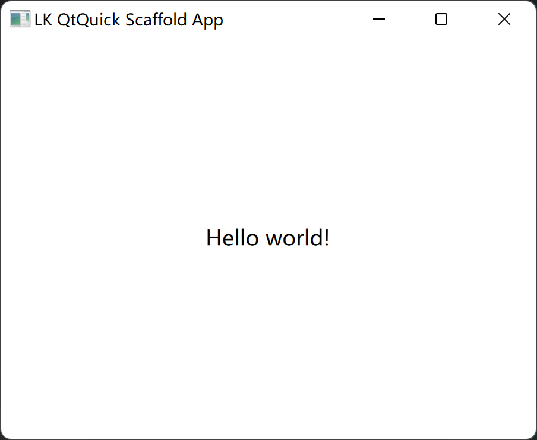
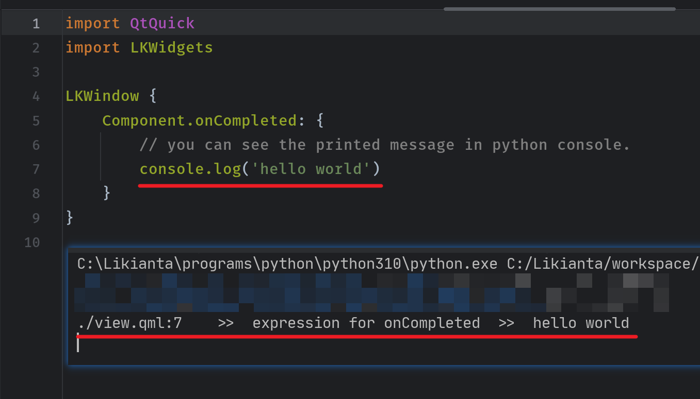
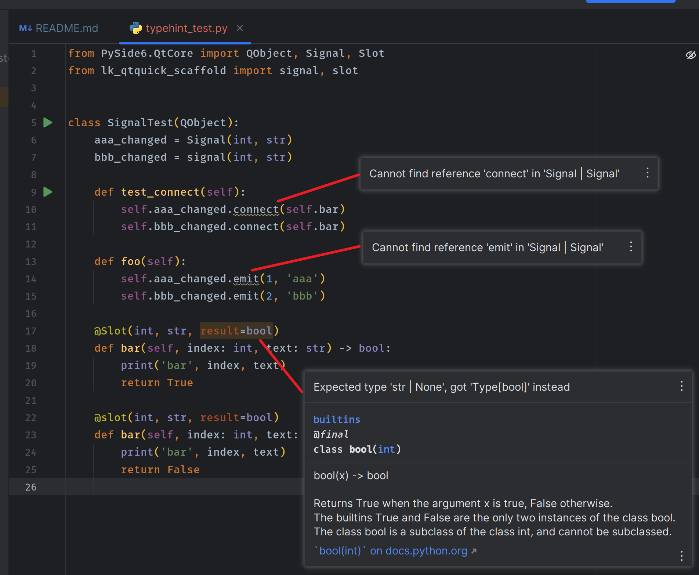
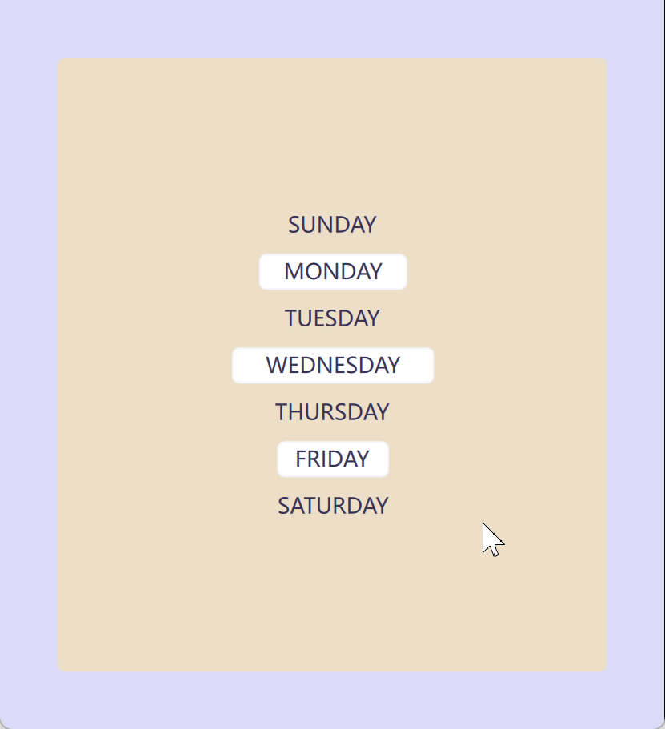
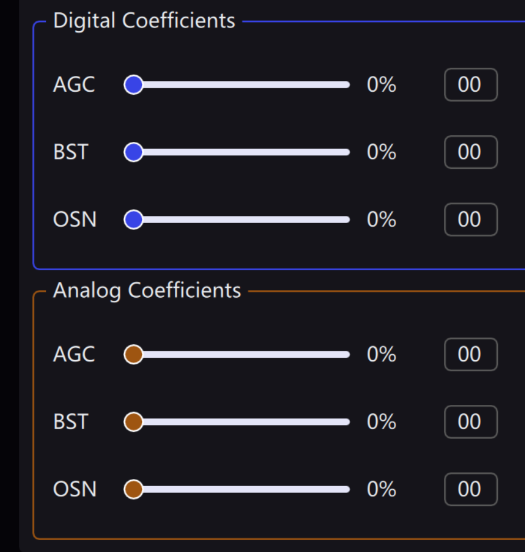
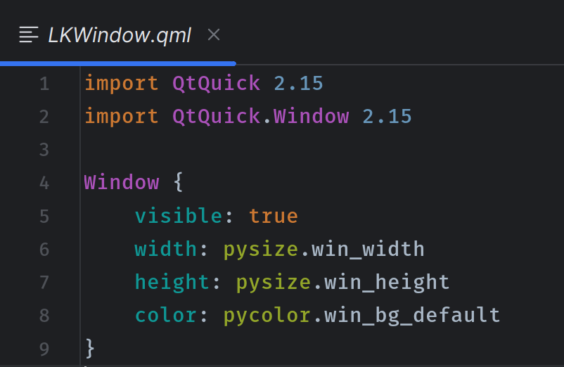
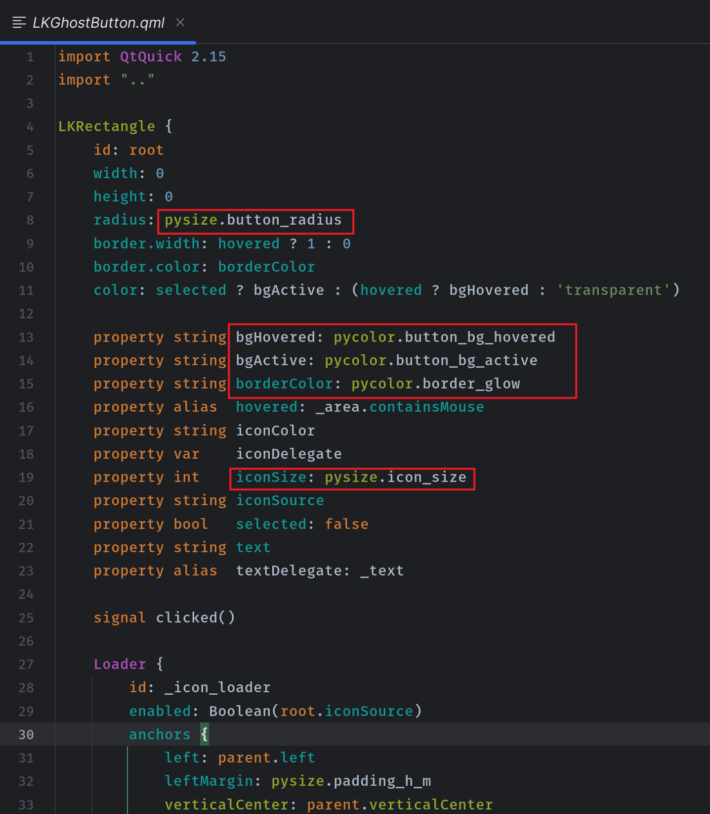
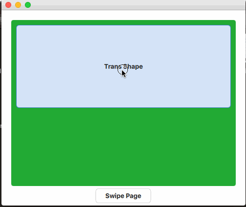

- [中文版](https://likianta.github.io/qmlease/)

# QmlEase

QmlEase is a flexible toolkit for Python programmer to efficiently develop QML 
graphical user interface, it is available for PySide6/PyQt6/PySide2/PyQt5.

## Note

This project is formerly known as [lk-qtquick-scaffold][1], we rename it to be 
"qmlease" and bring up the version from `2.0` to `3.0`. It means the the first 
release of this project would be `3.0.0`.

lk-qtquick-scaffold is going to be archived and no longer maintained, once 
after qmlease enters stable phase.

[1]: https://github.com/likianta/lk-qtquick-scaffold

## Highlights

- Support PySide6/PyQt6/PySide2/PyQt5.
- Simple to launch a QML application.
- Hot reload QML files in debug mode.
- Pythonic `signal` `slot` style.
- Powerful integrating Python with QML by register system.
- Show QML print messages in Python console.
- Built-in widgets library.
- Improved layout engine.
- Auto complete stylesheet.

## Installation

### Install QmlEase

> Warning: qmlease is not officially released yet. Below is a pre-documented
> guide for the near future. (i.e. Below command is not available for now.)

Use pip to install qmlease:

```shell
pip install qmlease
```

The latest version is `3.0+`.

### Install Qt backend

Installing qmlease doesn't include any of Python for Qt's libraries. You need 
to manually install one of the follows:

```shell
# choose one to install
pip install pyside6
pip install pyqt6
pip install pyside2
pip install pyqt5
```

QmlEase auto detects the Qt backend you've installed (you can also explicitly 
set specific one), it uses [qtpy](https://github.com/spyder-ide/qtpy) to  
provide an uniform layer overrides PySide6/PyQt6/PySide2/PyQt5.

## Examples quick through

### Hello world

view.qml

```qml
import QtQuick
import QtQuick.Window

Window {
    visible: true
    width: 400
    height: 300
    
    Text {
        anchors.centerIn: parent
        text: 'Hello world!'
    }
}
```

main.py

```python
from qmlease import app
app.run('view.qml')
```



### Hot loader

The `app.run` method accepts `debug` (bool type) parameter, to enable hot
loader mode:

```python
from qmlease import app
app.run('view.qml', debug=True)
```

It starts a floating window that includes a button "RELOAD", each time when you
modify "view.qml", click "RELOAD" to refresh your GUI:


BTW you can run "view.qml" in command line:

```shell
# see help
py -m qmlease -h

# run
py -m qmlease run view.qml

# run in debug mode
py -m qmlease run view.qml --debug
```


It has the same result like above "main.py" does.

### Register Python funtions to QML

```python
from qmlease import QObject, app, pyside, slot

class AAA(QObject):
    @slot(result=str)
    def hello(self):
        return 'hello world (aaa)'

class BBB(QOjbect):
    @slot(result=str)
    def hello(self):
        return 'hello world (bbb)'

# 1. register instance
aaa = AAA()
app.register(aaa, 'aaa')

# 2. register class
app.register(BBB, 'MyBbbType', namespace='dev.likianta.qmlease')

# 3. register regular function.
def foo(a: int, b: int, c: int):
    return a + b + c
pyside.register(foo)
pyside.register(foo, name='foo_alias')
```

view.qml

```qml
import QtQuick 2.15
import dev.likianta.qmlease 1.0

Item {
    MyBbbType {  // from `dev.likianta.qmlease`
        id: bbb
    }

    Component.onCompleted: {
        console.log(py.aaa.hello())  // -> 'hello world'
        console.log(bbb.hello())  // -> 'hello world'

        console.log(py.call('foo', [1, 2, 3]))  // -> 6
        console.log(py.call('foo_alias', [1, 2, 3])  // -> 6
    }
}
```

### Access QML object properties

```python
from qmlease import QObject, slot

class MyObject(QObject):
    @slot(object)
    def init_view(self, button: QObject) -> None:
        print(button['text'])  # -> 'AAA'
        button['text'] = 'BBB'  # this will emit a textChanged signal.
        print(button['text'])  # -> 'BBB'
```

### Connect QML signal to Python functions

```python
from lambda_ex import grafting
from qmlease import QObject, slot

class MyObject(QObject):
    @slot(object)
    def init_view(self, button: QObject) -> None:
        @grafting(button.clicked.connect)
        def _():
            print('clicked', button['text'])
```

### Integrate qt logging in python console

When you use `console.log` in QML side, it will be printed in Python console:



### Signal and Slot

The `signal` and `slot` wrap on Qt's `Signal` and `Slot` decorators, but
extended their functionalities:

1. You can get the correct type hint in IDE:

   

2. The `slot` accepts more types as alias to "QObject" and "QVariant" -- it is
   more convenient and more readable:

   ```python
   from qmlease import QObject, slot
   
   class MyObject(QObject):

       @slot(int, dict, result=list)  # <- here
       def foo(self, index, data):
           return [index, len(data)]
   
   '''
   it is more readable than:
       @Slot(int, QJSValue, result='QVariant')
       def foo(self, index, data):
           return [index, len(data)]
   '''
   ```

   Here is a full alias list (which is documented in 
   `qmlease/qt_core/signal_slot.py`):

   **slot(\*args)**

   | Alias         | Real value    | Note              |
   | ------------- | ------------- |------------------ |
   | `bool`        | `bool`        | basic type        |
   | `float`       | `float`       | basic type        |
   | `int`         | `int`         | basic type        |
   | `str`         | `str`         | basic type        |
   | `QObject`     | `QObject`     | object            |
   | `object`      | `QObject`     | object            |
   | `'item'`      | `QObject`     | object (string)   |
   | `'object'`    | `QObject`     | object (string)   |
   | `'qobject'`   | `QObject`     | object (string)   |
   | `dict`        | `QJSValue`    | qjsvalue          |
   | `list`        | `QJSValue`    | qjsvalue          |
   | `set`         | `QJSValue`    | qjsvalue          |
   | `tuple`       | `QJSValue`    | qjsvalue          |
   | `...`         | `QJSValue`    | qjsvalue          |
   | `'any'`       | `QJSValue`    | qjsvalue (string) |

   **slot(result=...)**

   | Alias     | Real value    | Note          |
   | --------- | ------------- |-------------- |
   | `None`    | `None`        | basic type    |
   | `bool`    | `bool`        | basic type    |
   | `float`   | `float`       | basic type    |
   | `int`     | `int`         | basic type    |
   | `str`     | `str`         | basic type    |
   | `dict`    | `'QVariant'`  | qvariant      |
   | `list`    | `'QVariant'`  | qvariant      |
   | `set`     | `'QVariant'`  | qvariant      |
   | `tuple`   | `'QVariant'`  | qvariant      |
   | `...`     | `'QVariant'`  | qvariant      |

3. `slot` decorator is non-intrusive -- it means the method been decorated can
   be called in Python side as usual.

   ```python
   from qmlease import QObject, slot

   class MyObject(QObject):
       @slot(int, str, result=list)
       def foo(self, index, name):
           return [index, name]

   my_obj = MyObject()
   # you can call it like a regular method! (just 'ignore' its docorator.)
   my_obj.foo(1, 'hello')  # -> [1, 'hello']
   ```

### Built-in widgets library

`qmlease` provides a set of built-in widgets under its `~/widgets` directory.

Basically, you can use it in QML by importing "LKWidgets" (or "LKWidgets 1.0"
for Qt 5.x):

```qml
import LKWidgets

LKWindow {
    color: '#DBDBF7'  // moon white

    LKRectangle {
        anchors.fill: parent
        anchors.margins: 32
        color: '#ECDEC8'  // parchment yellow

        LKColumn {
            anchors.centerIn: parent
            alignment: 'hcenter'  // horizontally center children

            LKGhostButton {
                text: 'SUNDAY'
            }

            LKButton {
                text: 'MONDAY'
            }

            LKGhostButton {
                text: 'TUESDAY'
            }

            LKButton {
                text: 'WEDNESDAY'
            }

            LKGhostButton {
                text: 'THURSDAY'
            }

            LKButton {
                text: 'FRIDAY'
            }

            LKGhostButton {
                text: 'SATURDAY'
            }
        }
    }
}
```



The dark theme:



More screenshots: see `examples/lk_widgets/screenshot_*`.

All widget names are started with 'LK', the full list is in
`qmlease/widgets/LKWidgets/qmldir` file.

Note: the widgets documentation is not ready. Currently you may have a look at
the `examples/lk_widgets` screenshots, or view its source code for more details.

### High-level model, human-readable API

*TODO*

### Layout engine

Layout engine is powered by `qmlease.qmlside.layout_helper`, which is 
registered as `pylayout` in QML side.

```qml
// some_view.qml
import QtQuick

Column {
    height: 100
    
    Item { id: item1; height: 20  }
    Item { id: item2; height: 0.4 }
    Item { id: item3; height: 0   }
    Item { id: item4; height: 0   }

    Component.onCompleted: {
        // horizontally center children
        pylayout.auto_align(this, 'hcenter')

        // auto size children:
        //  width > 1: as pixels
        //  width > 0 and < 1: as percent of left spared space
        //  width = 0: as stretch to fill the left spared space
        pylayout.auto_size_children(this, 'vertical')
        //  the result is:
        //      item1: 20px
        //      item2: (100 - 20) * 0.4 = 32px
        //      item3: (100 - 20 - 32) * 0.5 = 24px
        //      item4: (100 - 20 - 32) * 0.5 = 24px
        //          (item 3 and 4 share the left space equally.)
    }
}
```

### Executing Python snippet in QML, and vice versa

test.py

```python
from qmlease import eval_js

def foo(item1: QObject, item2: QObject):
    eval_js('''
        $a.widthChanged.connect(() => {
            $b.width = $a.width * 2
        })
    ''', {'a': item1, 'b': item2})
```

view.qml

```qml
import QtQuick

ListView {
    model: pyside.eval(`
        import os
        files = os.listdir(input('target folder: '))
        return files
    `)
}
```

## Style manager

`qmlease` exposes a list of built-in style controlers to QML side as follows:

| Style         | Description                                               |
| ------------- | --------------------------------------------------------- |
| `pycolor`     | All color specifications defined in a canonical name form |
| `pyfont`      | Font related specifications                               |
| `pysize`      | Width, height, radius, padding, margin, spacing, etc.     |
| `pymotion` | Animation related specifications (duration, easing type, etc.) |

Usage examples (seen in all LKWidgets):





You can overwrite the style by giving a YAML file to load, for example a
"dark-theme.yaml":

```yaml
# this is dark theme color scheme

# == general ==

blue_1: '#e4e5f8'
blue_3: '#5294eb'
blue_5: '#3844e6'
blue_7: '#0f143b'
dark_1: '#424141'
dark_2: '#242529'
dark_3: '#15141a'
dark_5: '#050408'
grey_3: '#e8eaed'
grey_5: '#a9acb0'

# == widgets spec ==

border_active: '#797171'
border_default: '#575757'
border_glow: '$border_active'
button_bg_active: '$blue_5'
button_bg_default: '$panel_bg'
button_bg_hovered: '$dark_1'
button_bg_pressed: '$dark_3'
button_bg_selected: '$button_bg_pressed'
input_bg_active: '$dark_2'
input_bg_default: '$panel_bg'
input_border_active: '$border_active'
input_border_default: '$border_default'
input_indicator_active: '$blue_5'
panel_bg: '$dark_3'
prog_bg: '$blue_1'
prog_fg: '$blue_5'
sidebar_bg: '$panel_bg'
text_default: '$grey_3'
text_disabled: '$grey_5'
text_hint: '$grey_5'
win_bg_default: '$dark_5'
```

The dollar symbol (`$`) is a simple pointer to the other key.

You don't need to write all colors in the file, `qmlease` has a great deduction 
algorithm to automatically call back "defaults" when required colors are 
missing from your sheet.

Finally load it by calling `pycolor.update_from_file()`:

```python
from qmlease import pycolor
pycolor.update_from_file('dark-theme.yaml')
```

Warning: currently color name style is under refactoring, it is very unstable
to learn from its style.

## Gallery





[](https://uimovement.com/media/resource_image/image_5213.gif.mp4)

https://user-images.githubusercontent.com/27986259/180829198-7110831e-c060-436a-a9be-c41452f49932.mp4

https://user-images.githubusercontent.com/27986259/180829267-cd497bcc-de38-4d00-bb19-c4a84b251031.mp4

*TODO:AddMoreWidgetsDemo*
