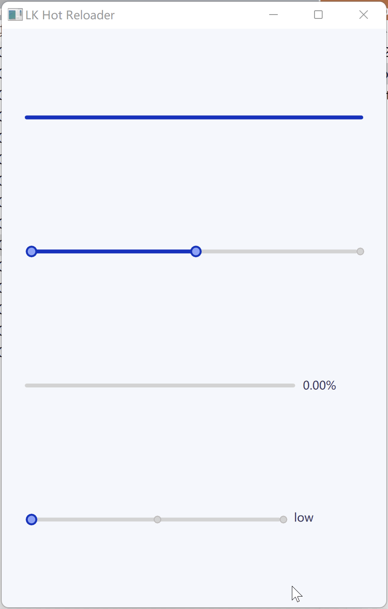

# 内置的组件库

qmlease 内置了一套经过精心设计的组件库, 提供开箱即用的便捷体验.

> 注: 目前只完成了一套亮色主题, 你可以通过 "LKWidgets" 来引入它们.

```qml
import LKWidgets

LKWindow {
    color: '#DBDBF7'  // moon white

    LKRectangle {
        anchors.fill: parent
        anchors.margins: 32
        color: '#ECDEC8'  // parchment yellow

        LKColumn {
            anchors.centerIn: parent
            alignment: 'hcenter'  // horizontally center children

            LKGhostButton {
                text: 'SUNDAY'
            }

            LKButton {
                text: 'MONDAY'
            }

            LKGhostButton {
                text: 'TUESDAY'
            }

            LKButton {
                text: 'WEDNESDAY'
            }

            LKGhostButton {
                text: 'THURSDAY'
            }

            LKButton {
                text: 'FRIDAY'
            }

            LKGhostButton {
                text: 'SATURDAY'
            }
        }
    }
}
```



