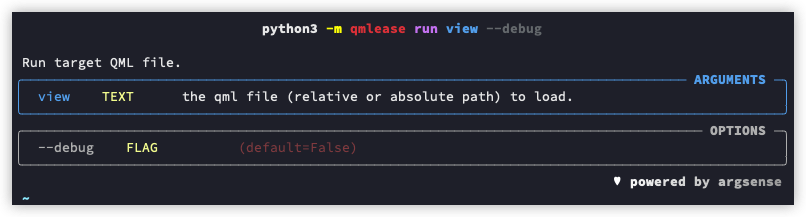

# 命令行模式启动

qmlease 支持从命令行启动.

使用 `py -m qmlease -h` 获取帮助信息:

```shell
# 全局帮助信息
py -m qmlease -h

# run 命令帮助
py -m qmlease run -h
```




`py -m qmlease run` 接收一个 qml 文件的路径作为参数, 省去了编写 "main.py". 同样以第一个示例作为演示, 我们可以直接启动 "view.qml":

```shell
# 启动
py -m qmlease run view.qml

# 以调试模式启动
py -m qmlease run view.qml --debug
```

效果与之前示例相同:


