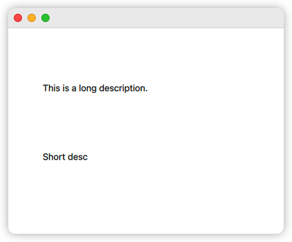

# Python 与 QML 的互操作

这是 qmlease 的重点功能. 通常来说, 我们习惯在 python 端完成比较复杂的逻辑操作, 而 qml 端专注 ui 相关的操作.

## 在 Python 端操作 QML 对象

大致可分为如下步骤:

1. 在 python 端创建一个类继承 `QObject`
2. 编写一个槽函数, 接收来自 qml 的 `QObject` 对象.
3. 对收到的对象进行操作 (主要用到 `QObject.property` 和 `QObject.setProperty`).

```
demo
|- main.py
|- view.qml
```

```python
# main.py
from qmlease import QObject, app, slot

class Main(QObject):
    @slot(object)
    def set_text_view(self, text_item: QObject) -> None:
        """
        如果 text_item 宽度大于 100px, 则显示 A 文字; 否则显示 B 文字.
        """
        if text_item['width'] > 100:
            text_item['text'] = 'This is a long description.'
        else:
            text_item['text'] = 'Short desc'

app.register(Main(), 'main')  # 注意第一个参数是类的实例.
app.run('view.qml')
```

```qml
// view.qml
import QtQuick

Window {
    visible: true
    width: 400
    height: 300

    Text {
        width: 200
        x: 50
        y: 80
        Component.onCompleted: {
            py.main.set_text_view(this)
        }
    }

    Text {
        width: 80
        x: 50
        y: 180
        Component.onCompleted: {
            py.main.set_text_view(this)
        }
    }
}
```



## 在 QML 端访问 Python 对象

步骤如下:

1. 在 python 端创建一个类继承 `QObject`
2. 将它的实例通过 `app.register` 注册到 qml 访问空间
3. qml 通过 `py.<name>` 获取到 python 对象 (可访问 "属性", "信号", "槽函数")

```python
# main.py
# 以下展示了信号, 属性, 槽函数的使用.
from time import sleep
from lk_utils import new_thread
from qmlease import AutoProp, QObject, app, signal, slot

class Main(QObject):
    aaa = AutoProp('You got AAA (0)')
    #   在 python 端, 你可以认为 aaa 是一个字符串, 并完全按照字符串对待它.
    #   在 qml 端, 使用 `get_aaa()` `set_aaa(...)` 进行读和写.
    #   同时, aaa 还自动生成了 `aaa_changed` 信号 (通过 qmlease 的魔术方法).
    bbb = signal(int)

    @slot(int, int)
    def ccc(self, offset: int, interval: int) -> None:

        @new_thread()
        def auto_update():
            for i in range(offset, offset + 100, interval):
                print(i)
                self.bbb.emit(i)
                self.aaa = f'You got AAA ({i})'
                #   当我们变更了 aaa 的值, 它会自动产生 
                #   `aaa_changed.emit('You got AAA ...')` 信号.
                sleep(0.5)

        auto_update()

app.register(Main(), 'main')  # 注意第一个参数是类的实例.
app.run('view.qml')
```

```qml
// view.qml
import QtQuick

Window {
    visible: true
    width: 400
    height: 300

    Text {
        anchors.centerIn: parent
        Component.onCompleted: {
            this.text = py.main.get_aaa()
            //                  ~~~~~~~~~
            py.main.aaa_changed.connect((new_text) => {
                //  ~~~~~~~~~~~          ~~~~~~~~
                this.text = new_text
            })

            py.main.bbb.connect((new_number) => {
                //  ~~~          ~~~~~~~~~~
                console.log('new number is ' + new_number)
            })
            
            console.log('start')
            py.main.ccc(100, 2)
            //          ~~~~~~ 起始值和间隔值.
        }
    }
}
```


